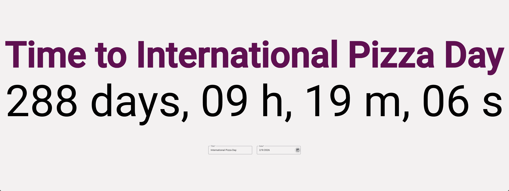
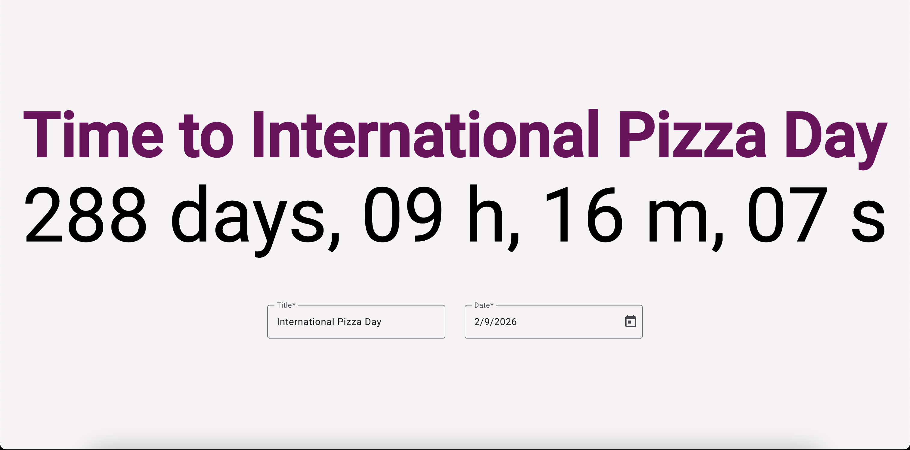
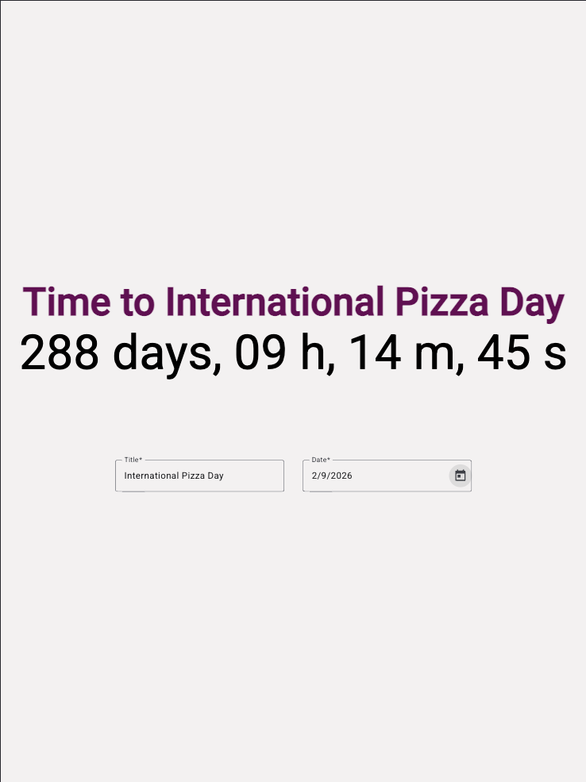
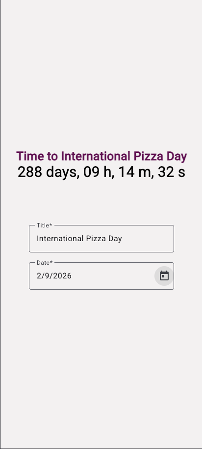

# Countdown App

A simple countdown timer application built with Angular 19.
Users can set an event name and a future date, and the app will display a live countdown to the selected date.

<p align="center">
  <br/>
  <em>4K Monitor</em>
</p>

<p align="center">
  <br/>
  <em>Laptop</em>
</p>

<p align="center">
  
  
  <br/>
  <em>Tablet &nbsp;&nbsp;&nbsp;&nbsp; Mobile</em>
</p>
</p>

## Getting Started

1. Clone the repository and navigate to the project directory:
2. Run `npm install` to install the required dependencies.
3. Run `ng serve` to start the development server.
4. Open your browser and navigate to `http://localhost:4200/` to view the application.

## Building

To build the project run:

```bash
ng build
```

This will compile your project and store the build artifacts in the `dist/` directory. By default, the production build optimizes your application for performance and speed.

## Running unit tests

To execute unit tests with the [Karma](https://karma-runner.github.io) test runner, use the following command:

```bash
ng test
```

## Possible Improvements

**UI**

1. Add UI element (e.g.button) to reset event and countdown
2. Switch date picker to datetime picker. Improved UX, enabling user to select a specific time during the day
3. Enable user input on date picker for improved accessibility - tabbing on calendar icon works, but text input is disabled

**Technical**

1. Modularise code for better readability and maintainability (e.g. create separate components for countdown and form)
2. Format locale to YYYY-MM-DD (currently MM-DD-YYY)
3. Extend test coverage
4. `endDate` retrieval and parsing from local storage takes longer than `eventName`’s retrieval - rendering strategy could be improved

## Assumptions

1. Date always refers to the start of the day. For example, let’s say I have a trip planned on 2024-06-21, then I would like the countdown to refer to the start of that day
2. Because of point 1, current date, as well as past dates, are disabled in date picker
3. When countdown hits 0, display `"00 days, 00 h, 00 m, 00 s"`. User should input a new date or refresh the page to start again
